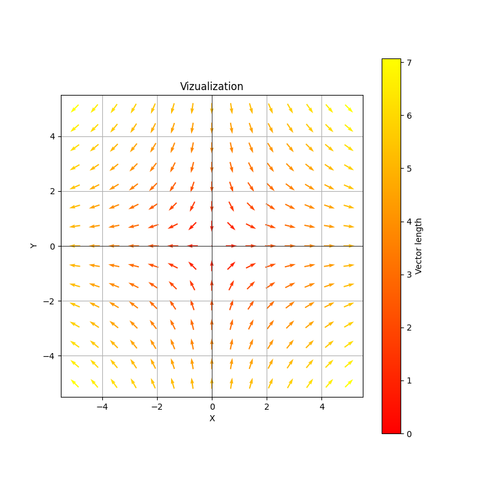
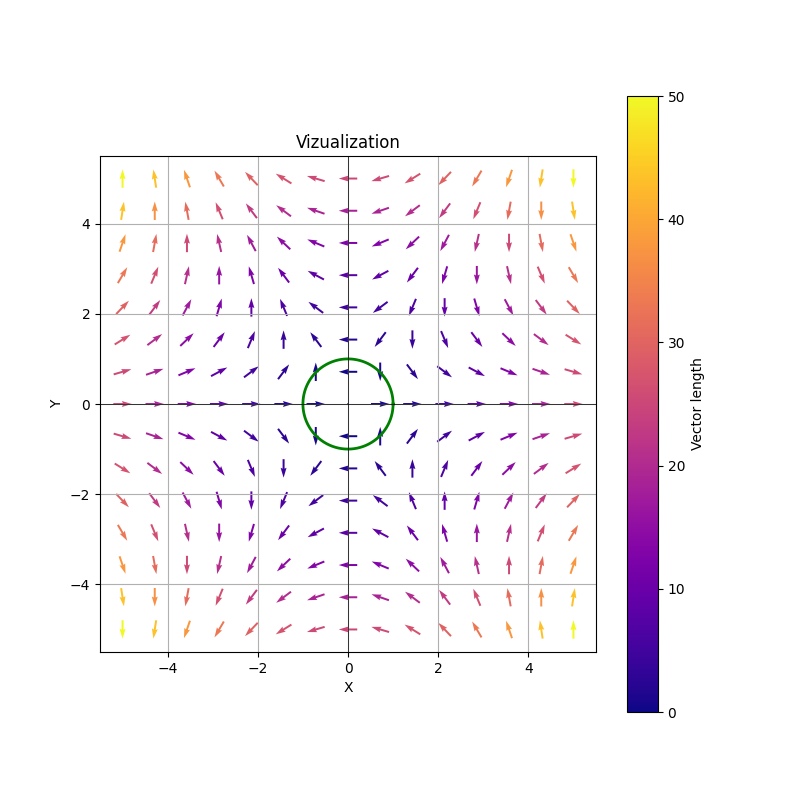
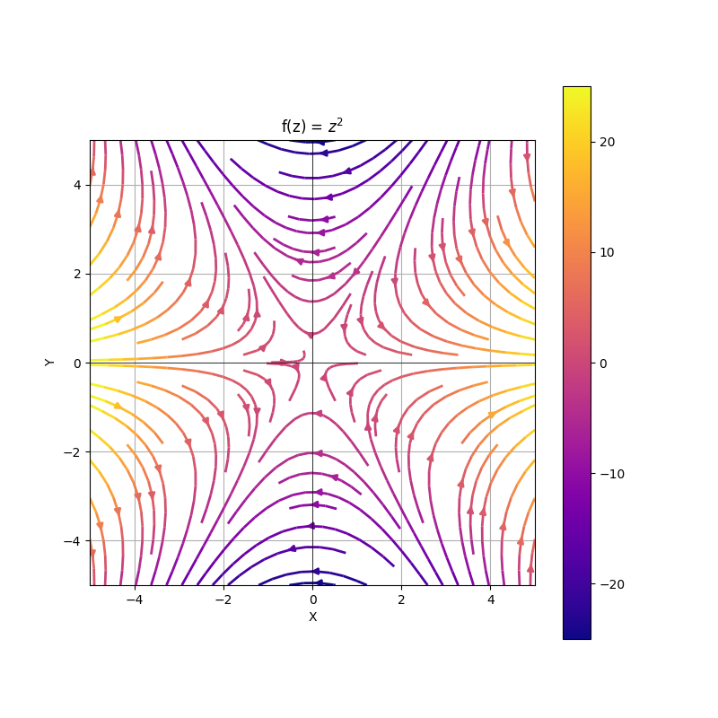
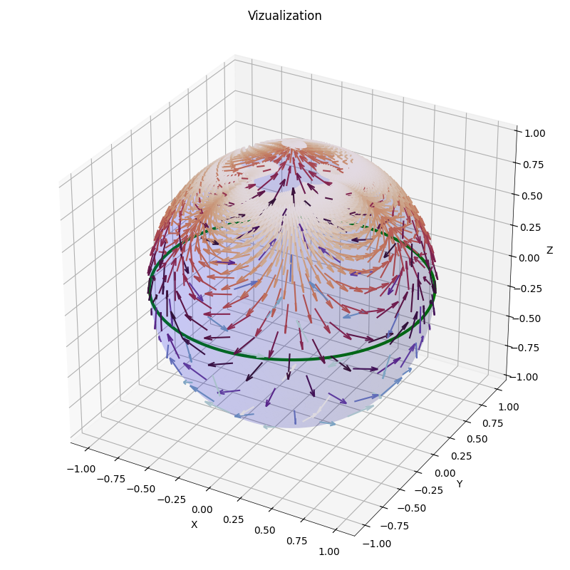
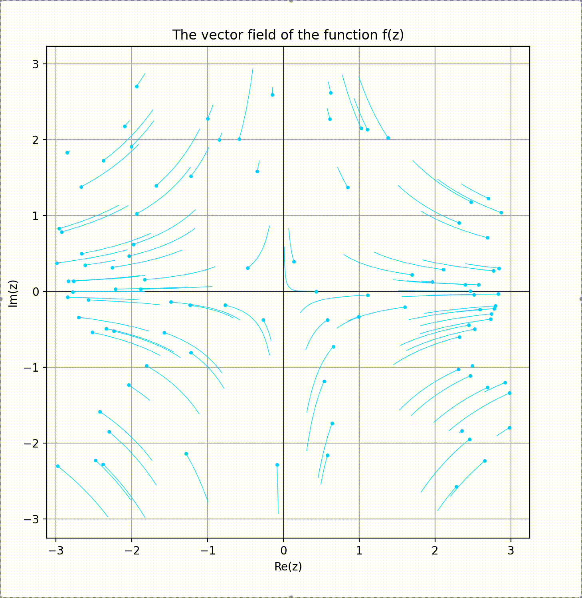
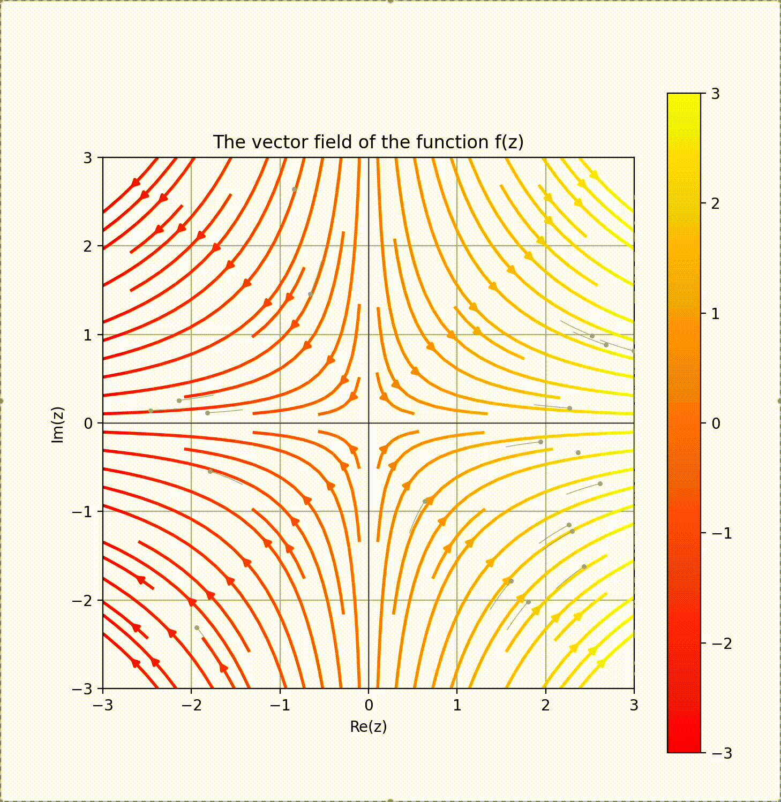
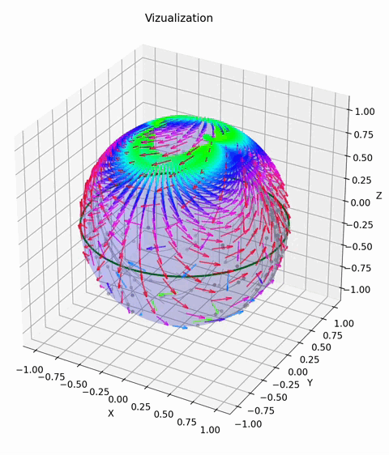
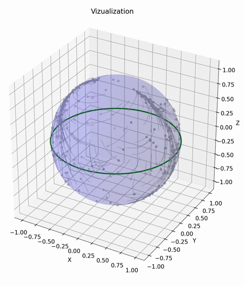

# Polya-Fields-Visualization

## Annotation
The Polya fields tool enhances the intuition of complex functions and their integrals through visualization. This package implements the visualization of complex functions using Polya fields.

## Overview
The module provides four functions for visualizing complex functions via Polya fields:
1. **Static vector field/streamlines**: `visualization`
2. **Animated vector field/streamlines**: `visualization_anim`
3. **Static Riemann sphere visualization (vectors/streamlines)**: `visualization_sphere`
4. **Animated Riemann sphere visualization**: `animate_sphere`

---

## Function Usage

### Core Parameters
All functions require these parameters:

| Position | Parameter   | Type                                   | Description                                                                 | Example                          |
|----------|-------------|----------------------------------------|-----------------------------------------------------------------------------|----------------------------------|
| 1        | `f`         | `Callable`                             | Complex function to visualize                                               | `f = lambda z: z`               |
| 2        | `x_range`   | `tuple` (min, max, count) or `list`    | X-axis range (min, max, subdivisions) or explicit list of values           | `(-2, 2, 30)` or `[-1.5, 0, 1.5]` |
| 3        | `y_range`   | `tuple` (min, max, count) or `list`    | Y-axis range (min, max, subdivisions) or explicit list of values           | `(-2, 2, 30)` or `[-1.5, 0, 1.5]` |

---

### Optional Parameters

#### General Settings (All Functions)

| Parameter             | Type                      | Description                                                                 | Default               |
|-----------------------|---------------------------|-----------------------------------------------------------------------------|-----------------------|
| `fig_size`            | `tuple`                   | Figure dimensions (width, height)                                           | `(8, 8)`             |
| `title_plot`          | `str`                     | Plot title                                                                  | `"Visualization"`     |
| `contour_func`        | `Callable`                | Function defining a closed contour                                          | `None`                |
| `contour_color`       | `str`                     | Contour line color                                                          | `"green"`             |
| `contour_linewidth`   | `float`/`int`             | Contour line thickness                                                      | `2.0`                 |
| `label_x`             | `str`                     | X-axis label                                                                | `"X"`                 |
| `label_y`             | `str`                     | Y-axis label                                                                | `"Y"`                 |
| `color_line_x`        | Matplotlib color          | X-axis color                                                                | `"black"`             |
| `color_line_y`        | Matplotlib color          | Y-axis color                                                                | `"black"`             |
| `width_line_x`        | `float`/`int`             | X-axis line thickness                                                       | `0.5`                 |
| `width_line_y`        | `float`/`int`             | Y-axis line thickness                                                       | `0.5`                 |
| `color_vector`        | [Matplotlib colormap](https://matplotlib.org/stable/gallery/color/colormap_reference.html)      | Colormap for vectors/streamlines  | `"autumn"` |
| `width_line`          | `float`/`int`             | Line thickness for vectors/streamlines                                      | `2.0`                 |
 `eps`          | `float`/`int`             | Possible deviation                                  | `1e-100`                 |

---

#### 2D Settings (`visualization`, `visualization_anim`)

| Parameter           | Type             | Description                                  | Default     |
|---------------------|------------------|----------------------------------------------|-------------|
| `type_plot`           | `"vector"` or `"stream"`  | Visualization mode (`vector` for arrows, `stream` for flow lines)           | `"vector"`            |
---

#### Riemann Sphere Settings (`visualization_sphere`, `animate_sphere`)

| Parameter           | Type             | Description                                  | Default     |
|---------------------|------------------|----------------------------------------------|-------------|
| `label_z`           | `str`            | Z-axis label                                 | `"Z"`       |
| `color_line_z`      | Matplotlib color | Z-axis color                                 | `"black"`   |
| `width_line_z`      | `float`/`int`    | Z-axis line thickness                        | `0.5`       |
| `vector_length`     | `float`/`int`    | Vector length on the sphere                  | `0.2`       |
| `subsampling`       | `int`            | Vector subsampling rate (higher - sparser)   | `2`         |

---

#### Animation Settings (`visualization_anim`, `animate_sphere`)

| Parameter           | Type             | Description                                                                 | Default       |
|---------------------|------------------|-----------------------------------------------------------------------------|---------------|
| `show_vectors`      | `bool`           | Toggle background vectors/streamlines                                      | `False`       |
| `num_particles`     | `int`            | Number of animated particles                                               | `20`          |
| `dt`                | `float`/`int`    | Time step for particle motion                                               | `0.1`         |
| `trail_length`      | `int`            | Length of particle trails (in frames)                                      | `5`           |
| `trail_width`       | `int`    | Trail line thickness                                                        | `0.5`         |
| `frames`            | `int`            | Total animation frames                                                     | `100`         |
| `interval`          | `int`            | Delay between frames (milliseconds)                                        | `50`          |
| `color_particles`   | [Matplotlib color](https://matplotlib.org/stable/gallery/color/named_colors.html) | Particle/trail color | `"darkgray"` |

---

# Examples

## 1. Static 2D
```python
visualization(
    lambda z: z, 
    (-5, 5, 15), (-5, 5, 15)
)
```

```python
visualization(
    lambda z: z * z,
    (-5, 5, 15), (-5, 5, 15),
    type_plot="vector",
    color_vector="plasma",
    contour_func=lambda t: np.exp(1j*t)
)
```

```python
visualization(
    lambda z: z * z,
    (-5, 5, 70), (-5, 5, 70),
    type_plot="stream",
    color_vector="plasma",
    title_plot='f(z) = $z^2$'
)
```


## 2. Static sphere
```python
visualization_sphere(
    lambda z: z * z,
    (-5, 5, 50), (-5, 5, 50),
    color_vector="twilight",
    contour_func=lambda t: np.exp(2j * np.pi * t),
    contour_linewidth=3
)
```

## 3. Animmation 2D
```python
visualization_anim(
    lambda z: z,
    (-3, 3, 50), (-3, 3, 50),
    color_vector="plasma",
    num_particles=100,
    dt=0.05,
    trail_length=20,
    color_particles="xkcd:neon blue",
    frames=200,
    interval=30
)
```

```python
visualization_anim(
    lambda z: z,
    (-3, 3, 50), (-3, 3, 50),
    show_vectors=True
)
```

## 4. Animmation sphere
```python
animate_sphere(
    lambda z: z,
    (-5, 5, 50),(-5, 5, 50),
    num_particles=250,
    show_vectors=True,
    color_vector="hsv",
    contour_func=lambda t: np.exp(2j * np.pi * t)
)
```

```python
animate_sphere(
    lambda z: z,
    (-5, 5, 50),(-5, 5, 50),
    num_particles=300,
    contour_func=lambda t: np.exp(2j * np.pi * t)
)
```

#  Installation
Run in terminal:
```bash
pip install git+https://github.com/antipula38/polya_fields_visualization.git
```
After installation, import the visualization functions in your Python code:
```python
from polya_fields_visualization import visualization, visualization_sphere, animate_sphere, visualization_anim
```
