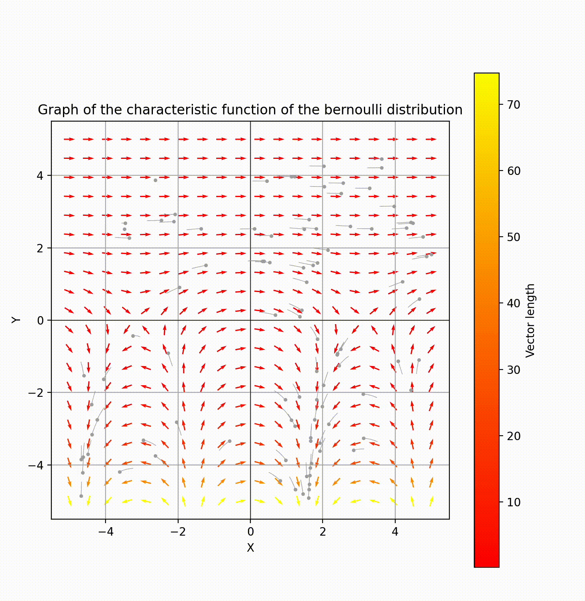
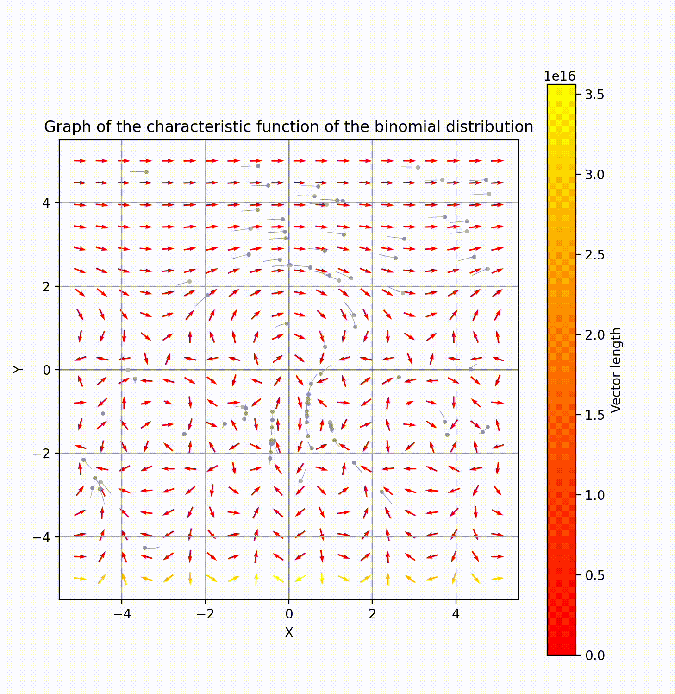
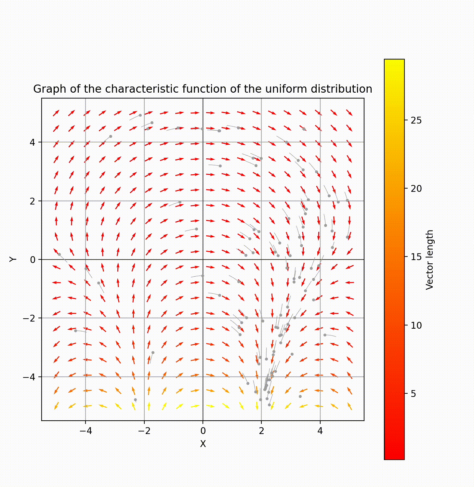
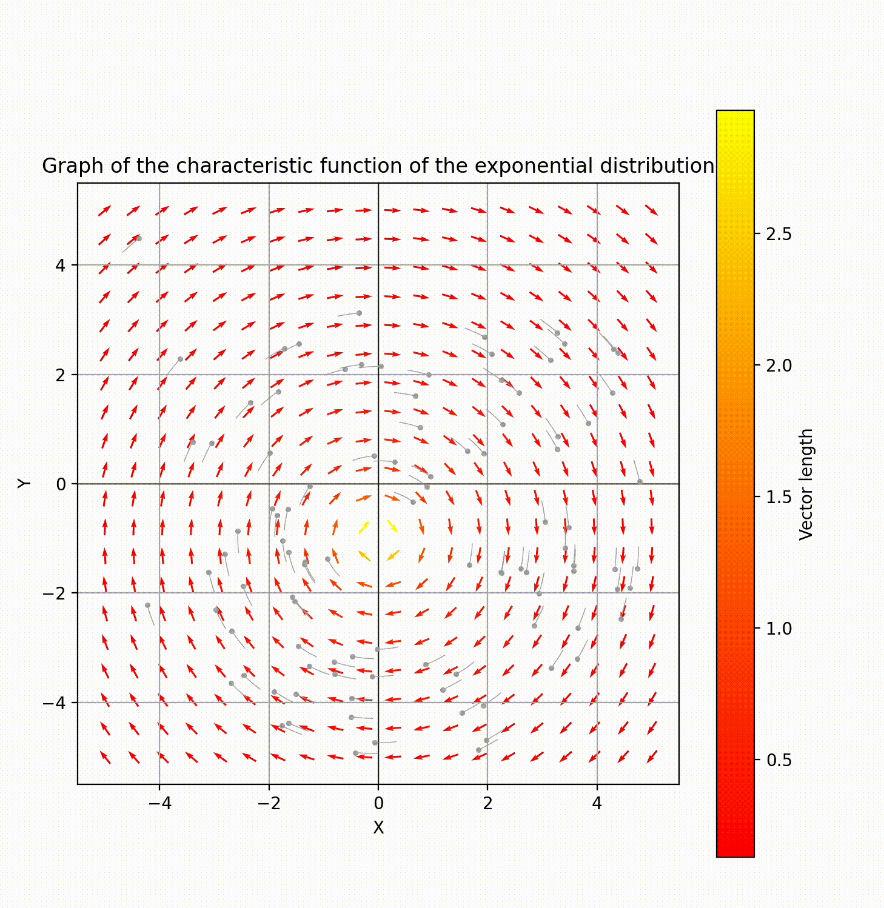
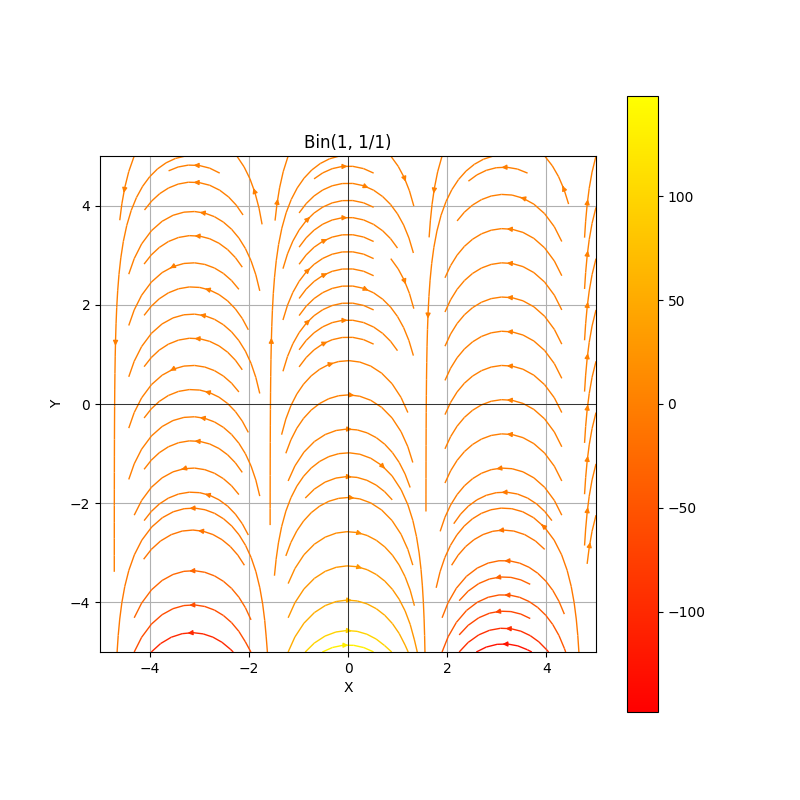
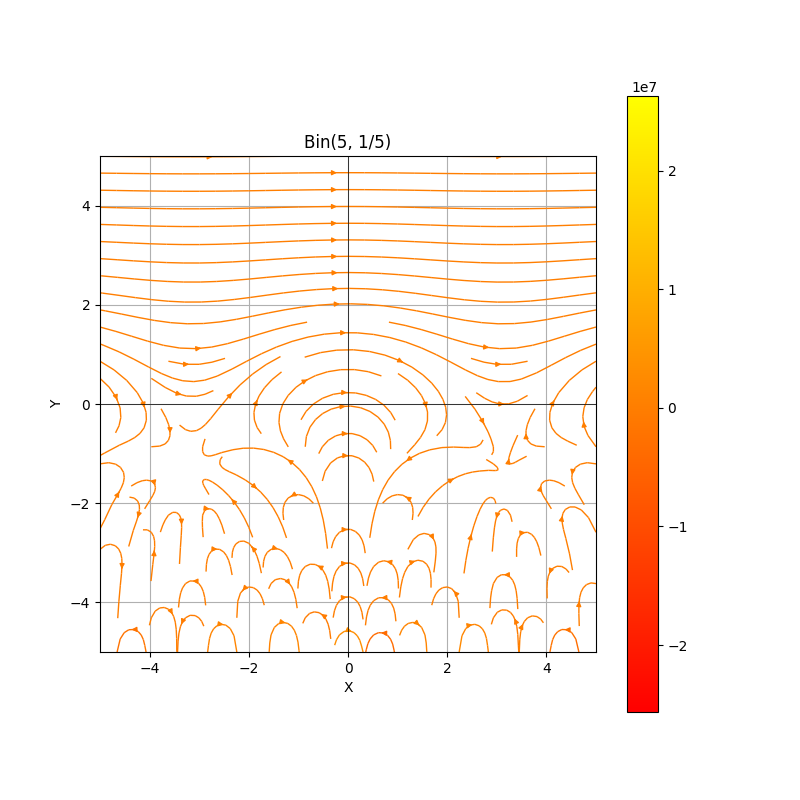
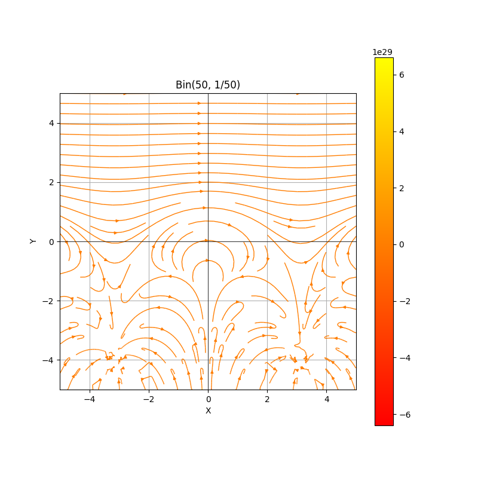
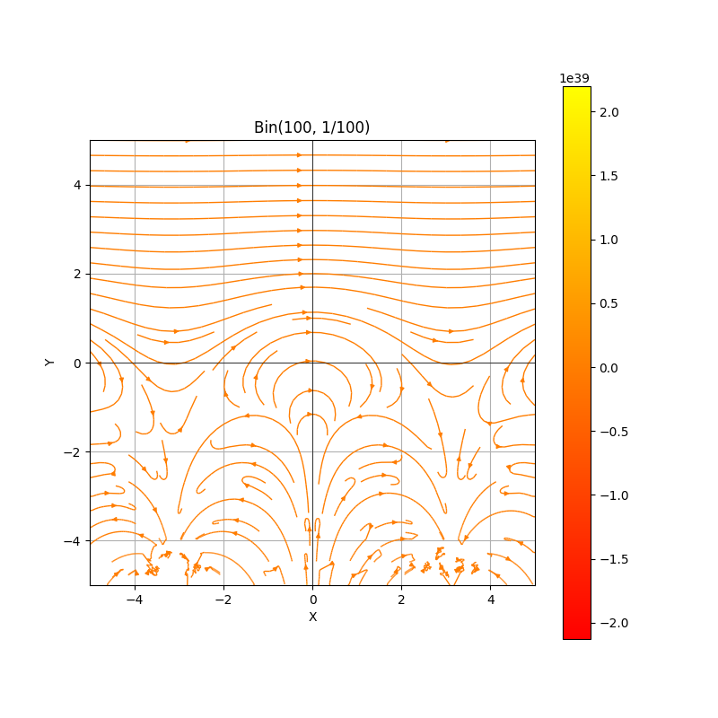

# Characteristic Functions of Distributions

## Examples of Distributions and Their Plots
First, let's import the necessary modules:
```python
from polya_fields_visualization import visualization, visualization_sphere, animate_sphere, visualization_anim
import numpy as np
```

### 1. Normal Distribution $\mathcal{N}(\mu, \sigma^2)$
- **Parameters**: $\mu \in \mathbb{R}$, $\sigma^2 > 0$.
```python
def normal_characteristic(t, mu=0, sigma=1):
    return np.exp(1j * mu * t - 0.5 * (sigma ** 2) * (t ** 2))

visualization_anim(normal_characteristic, (-5, 5, 500), (-5, 5, 500), show_vectors=True,type_plot="stream", num_particles=200, title_plot="Graph of the characteristic function of the normal distribution")
```
.gif)

### 2. Bernoulli Distribution $\text{Bernoulli}(p)$
- **Parameter**: $p \in [0, 1]$.
```python
def bernoulli_characteristic(t, p=0.5):
    return 1 - p + p * np.exp(1j * t)

visualization_anim(bernoulli_characteristic, (-5, 5, 20), (-5, 5, 20), show_vectors=True, num_particles=100, title_plot="Graph of the characteristic function of the bernoulli distribution")
```

### 3. Binomial Distribution $\text{Binomial}(n, p)$
- **Parameters**: $n \in \mathbb{N}$, $p \in [0, 1]$.
```python
def binomial_characteristic(t, n=10, p=0.3):
    return (1 - p + p * np.exp(1j * t))**n

visualization_anim(binomial_characteristic, (-5, 5, 20), (-5, 5, 20), show_vectors=True, num_particles=100, title_plot="Graph of the characteristic function of the binomial distribution")
```


### 4. Poisson Distribution $\text{Poisson}(\lambda)$
- **Parameter**: $\lambda > 0$.
```python
def poisson_characteristic(t, l=1):
    return np.exp(l * (np.exp(1j * t) - 1))

visualization(poisson_characteristic, (-5, 5, 10000), (-5, 5, 10000),type_plot="stream", title_plot="Graph of the characteristic function of the Poisson distribution")

```
.png)
### 5. Uniform Distribution $\text{Uniform}(a, b)$
- **Parameters**: $a < b$.
```python
def uniform_characteristic(t, a=0, b=1):
    if t == 0:
        return 1.0
    return (np.exp(1j * t * b) - np.exp(1j * t * a)) / (1j * t * (b - a))

visualization_anim(uniform_characteristic, (-5, 5, 20), (-5, 5, 20), show_vectors=True, num_particles=100, title_plot="Graph of the characteristic function of the uniform distribution")
```

### 6. Exponential Distribution $\text{Exp}(\lambda)$
- **Parameter**: $\lambda > 0$.
```python
def exponential_characteristic(t, l=1):
    return l / (l - 1j * t)

visualization_anim(exponential_characteristic, (-5, 5, 20), (-5, 5, 20), show_vectors=True, num_particles=100, title_plot="Graph of the characteristic function of the exponential distribution")
```

## Transition from Binomial to Poisson distribution





.png)